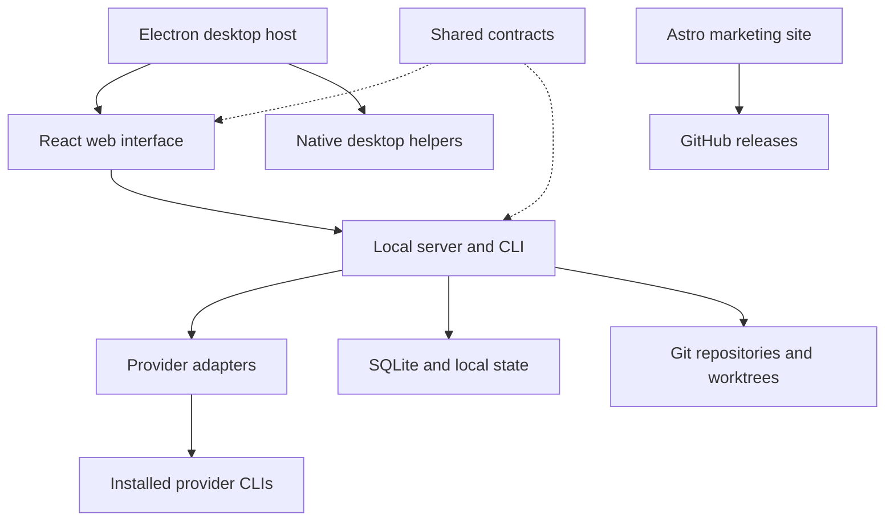

# Architecture

`apps/web` owns the React interface, `apps/server` the server and CLI, and
`apps/desktop` Electron and native host integration. `packages/contracts` defines
cross-process schemas; `packages/shared` contains explicit shared utilities.
`scripts` owns development and packaging tools. `apps/marketing` is the
Trellis Astro site, styled from smeltery/loft and smeltery/convrt.

Provider adapters own provider-specific behavior. Preserve cancellation,
reconnect, process cleanup, migration recovery, and platform boundaries when
integrating upstream changes. Native Cua patches have committed SHA-256 pins;
branding changes invalidate those pins and require native rebuilds.
