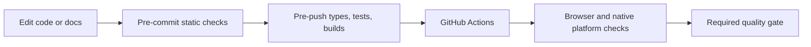

# Development, Flox, and CI

Flox is the reproducible development entry point. Its committed manifest and
lockfile supply Bun, Node 24, Git, pre-commit, actionlint, and ShellCheck. The locked
environment supports Apple Silicon macOS and x64/ARM64 Linux. Windows and Intel
Mac developers can use the versions in `package.json` directly; Windows runtime
checks remain native GitHub Actions jobs.

```sh
flox activate
bun install --frozen-lockfile
bun run hooks:install
bun run dev
```

Use `bun run dev:desktop` for Electron and `bun run dev:marketing` for Astro.
Flox also defines `web` and `marketing` services; use `flox services start web`
inside an activation. Keep production state separate from development instances.



| Command                    | Purpose                                                                                             |
| -------------------------- | --------------------------------------------------------------------------------------------------- |
| `bun run check:static`     | Branding, Markdown, Mermaid, links, formatting, lint, CI contracts, Windows boundary, release smoke |
| `bun run check`            | Static checks, workspace types/tests, desktop and marketing builds                                  |
| `bun run docs:check`       | Markdown style, real Mermaid parsing, local link existence                                          |
| `bun run test`             | Vitest workspace tests; do not substitute `bun test`                                                |
| `bun run migrations:check` | Released migration lineage; requires fetched release tags                                           |
| `actionlint`               | GitHub Actions syntax validation                                                                    |

Hooks call the same commands as CI through Flox. Browser and native OS checks run
in CI on their intended platforms. Install Chromium before running browser tests
locally. Markdown linting covers the maintained README and Trellis guides;
historical upstream evidence is preserved separately from this maintained scope.

Bun manages dependencies, lockfiles, workspace tasks, and suitable scripts. Node
24 remains required for the existing tooling and Electron-related paths. A runtime
migration is a separate change requiring platform validation.
