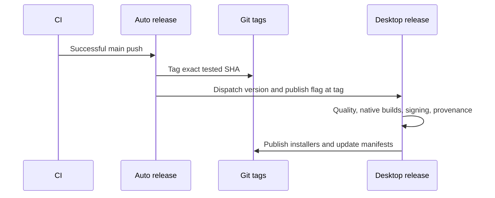

# Automatic releases

The automatic release workflow follows `smeltery/hab`: after successful CI on a
push to `main`, find the newest stable semantic tag, increment its patch version,
create the tag, and explicitly dispatch the release build. Prerelease tags are
excluded. With no fork release tags, the initial version comes from the desktop
package manifest, keeping it above the inherited compatibility floor. The tag points to the exact tested commit, not a newer main HEAD.
Re-running dispatch for an existing tag supports recovery from a failed build.



The existing multi-platform release pipeline remains authoritative. GitHub's
workflow token does not trigger tag-push workflows recursively, so the explicit
workflow dispatch is necessary. Publication uses the fork repository and Trellis
update channels; no Synara release or feed is modified.

Before the first published release, configure Apple signing/notarization and
Windows signing credentials described in the inherited [release reference](../release.md).
Use `TRELLIS_` in place of that reference's historical environment prefix, and
`smeltery/trellis` as the update repository. Optional CLI publishing requires a
separately configured npm package and trusted publisher. Missing signing
credentials fail publication; local builds do not establish signed-release readiness.

Validate without publishing:

```sh
gh workflow run release.yml --ref BRANCH -f version=1.0.1 -f publish_release=false
```

Inspect all platform results and install the artifacts on each target OS before
claiming platform qualification. The fork uses the exact Hab license at the root;
the original MIT notice is retained in `fork/UPSTREAM-LICENSE` and shipped in
server and desktop resources alongside the fork license.
