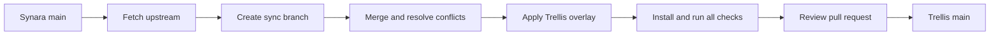

# Update from Synara

The fork retains Synara's Git history and uses ordinary merge commits. Mechanical
branding substitutions live in `fork/rebrand.mjs`; canonical artwork and the
supplied site live in `fork/branding` and `fork/marketing`. Fork-specific functional
changes remain normal commits, so Git can merge upstream code around them.



From a clean committed checkout of the current Trellis main branch:

```sh
flox activate
bun run upstream:sync
```

The command verifies the upstream remote, fetches `upstream/main`, creates a sync
branch, enables Git rerere, and prepares an uncommitted merge. It never pushes,
force-resets, or automatically chooses a side in a conflict. If already current,
it exits without creating a branch.

When conflicts occur, resolve code changes normally. Retain Trellis's `LICENSE`,
README, `fork/`, `.flox/`, hooks, and release/CI customizations. The marketing site
is fork-owned; upstream marketing changes require explicit adaptation rather than
replacing the supplied site. Preserve upstream attribution in
`fork/UPSTREAM-LICENSE`. Stage resolutions, then:

```sh
bun run brand:apply
bun install
bun run fmt
bun run check
bun run migrations:check
git diff --check
```

Review all substitutions and updated native patch digests. Native patch changes
must pass native CI; a new digest alone is not proof that the patch applies.
Keep package metadata and the Bun lockfile synchronized. Commit the merge with a
conventional message, push the sync branch, and open a PR. Wait for all CI lanes.
Use `git merge --abort` to abandon a merge before committing.

`brand:apply` replaces `apps/marketing` from its canonical copy, so edit
`fork/marketing` first and run the overlay before installing dependencies.
The overlay is deterministic but cannot resolve semantic conflicts. It must never
be used as a substitute for reviewing provider, migration, or process changes.
Historical docs, evidence, and upstream license notices intentionally retain their
original names. `brand:check` checks active source identities and key asset bytes.
