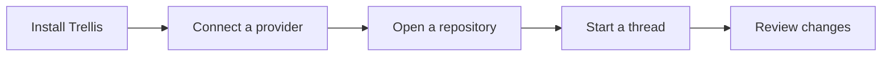

# Install and start

Download an installer for your operating system from
[Trellis releases](https://github.com/smeltery/trellis/releases). Choose the Mac
architecture matching your machine, the Windows x64 installer, or Linux x64 AppImage.
If no release is available yet, use the [source setup](../maintainers/development.md).

1. Install and open Trellis.
2. Install and sign in to a supported provider's CLI on the same machine.
3. Open a local Git repository as a project.
4. Create a thread, select an available provider and model, and describe your task.
5. Review approval requests and inspect changes before committing.

Provider access comes from your existing account or credentials. Installing Trellis
does not include a model subscription. See [provider setup](providers.md).

Trellis has its own app identity and data directory. It can coexist with Synara;
it does not automatically import or modify Synara's state.

## Unsigned downloads

Some Trellis releases are unsigned. Check the release notes and the artifact's
provenance JSON for signing status and SHA-256 before installing. macOS may block
apps that are not notarized, and Windows may show SmartScreen warnings. Only
install software you trust. Building from source is also supported; see the
[development guide](../maintainers/development.md).
