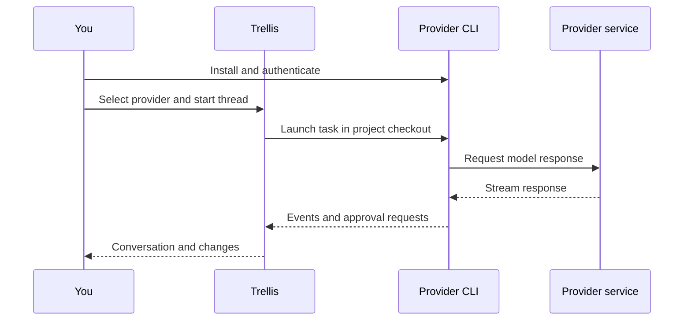

# Connect coding providers

Trellis integrates provider command-line tools through separate adapters. Install
the tool for your chosen provider and complete its authentication before starting
Trellis. The provider must be available in the environment that launches the server.

Supported adapters include Codex, Claude Code, Cursor, Antigravity, Grok,
Factory Droid, OpenCode, Pi, Devin, and OMP. Availability depends on the installed
CLI, its version, account access, and platform. Trellis shows the capabilities
reported by each adapter; models, effort settings, approvals, and session recovery
are not interchangeable across providers.

If a provider is unavailable, run its executable from the same shell used to
launch Trellis, verify authentication, and restart the affected thread. Never
paste credentials into an issue or a chat prompt to diagnose authentication.
