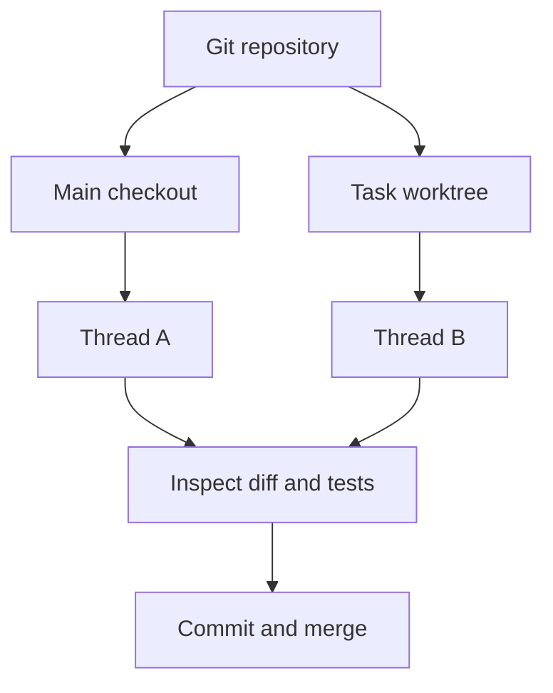

# Projects, threads, and worktrees

A **project** is a repository you work on. A **thread** is an agent conversation
with its own execution state. A **worktree** gives a task a separate Git checkout
so parallel work does not share the same edited files.

Open a project from the sidebar, then create a thread. Choose the main checkout
for small sequential changes or a worktree for isolated work. Keep terminals in
the intended checkout and inspect the Git diff before committing.

Provider capabilities differ. An approval request pauses the affected operation;
read the proposed command and scope before approving. Stop a running turn from
the conversation controls when you need to change direction.

Your conversation and project state are stored locally. Back up your data before
manual recovery or moving between machines; see [configuration](configuration.md).
